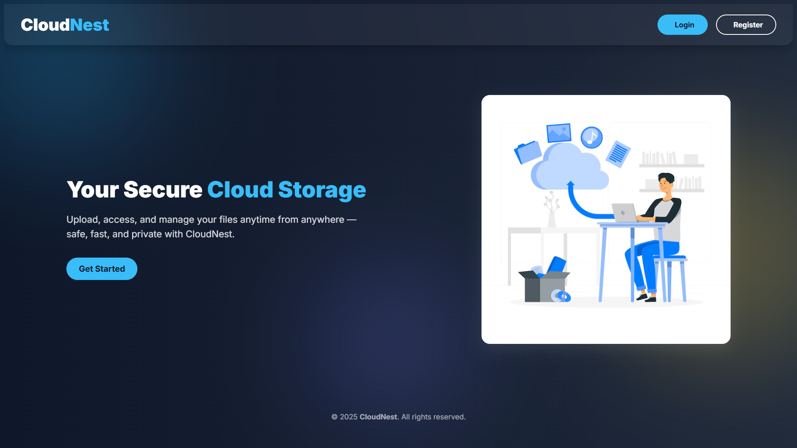
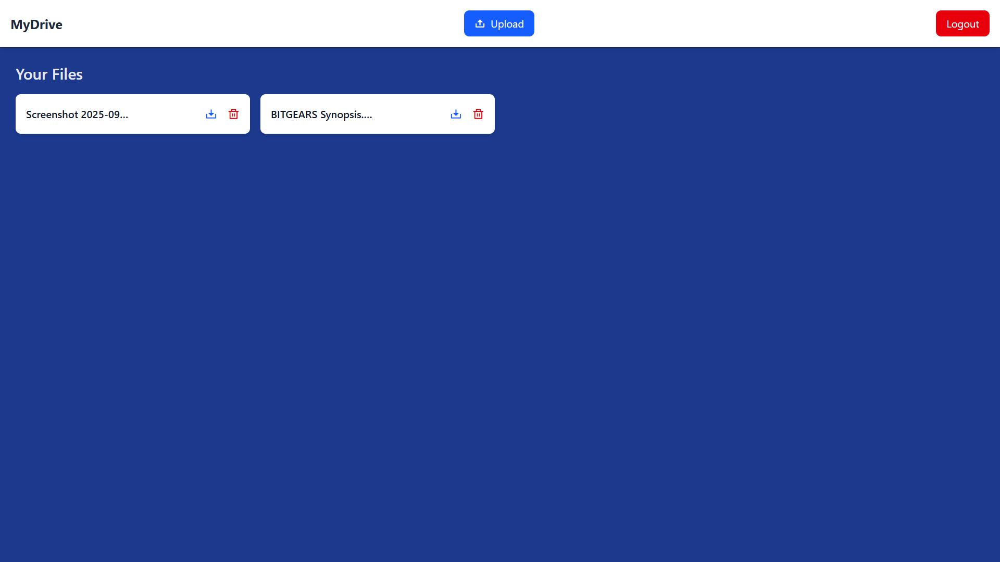
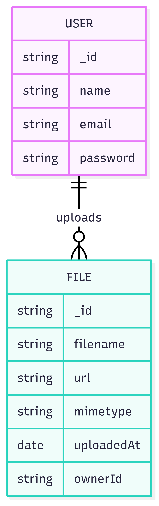
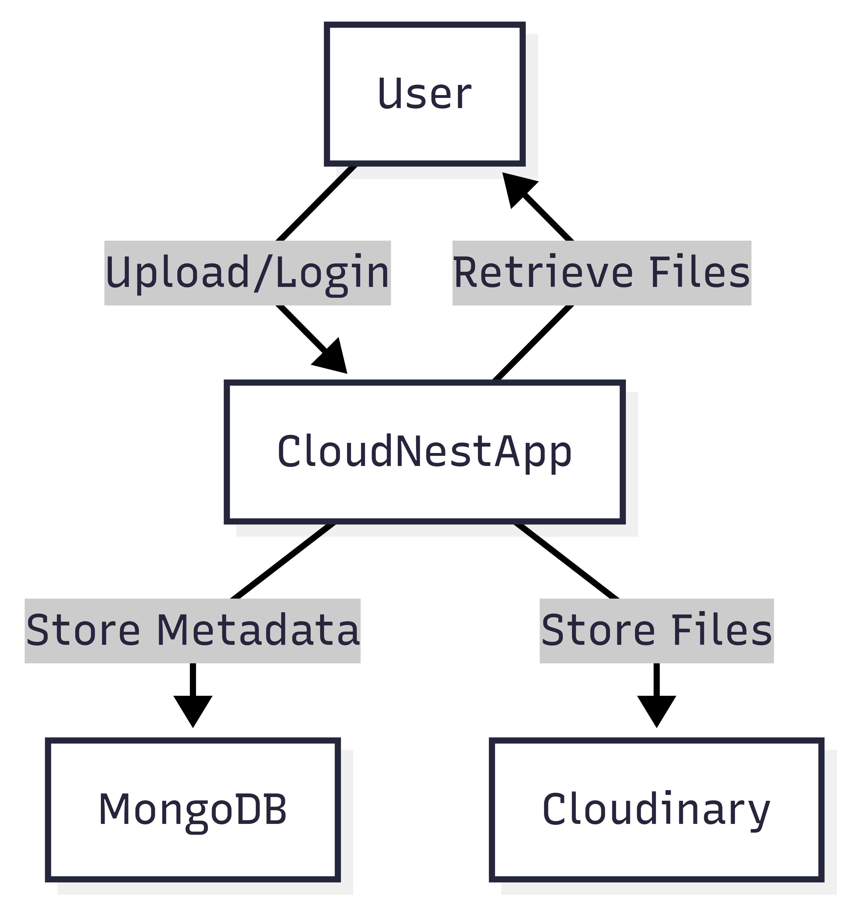
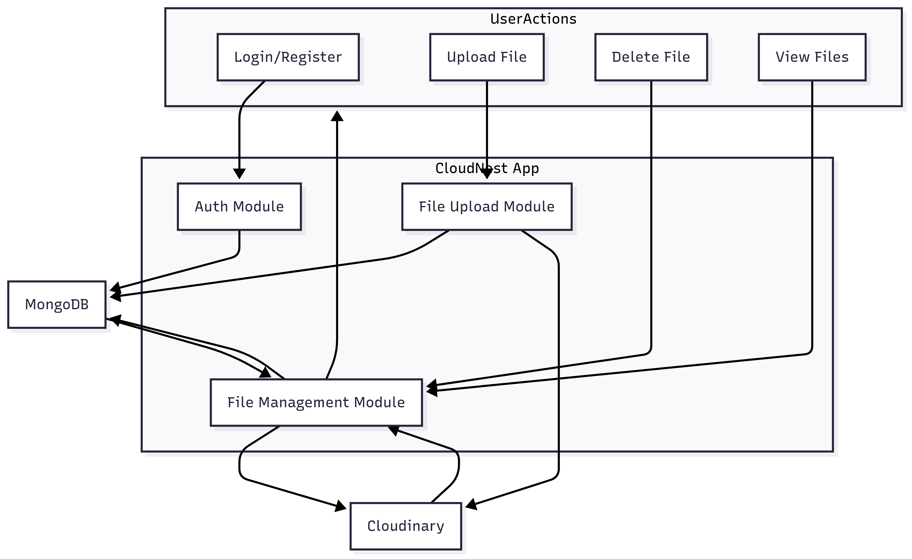
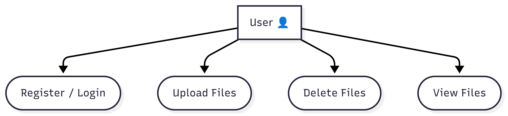
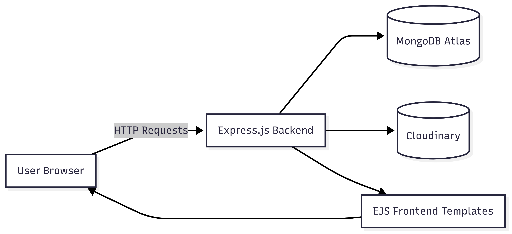
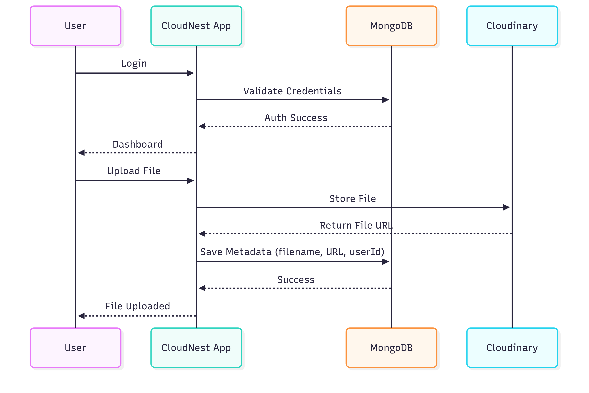
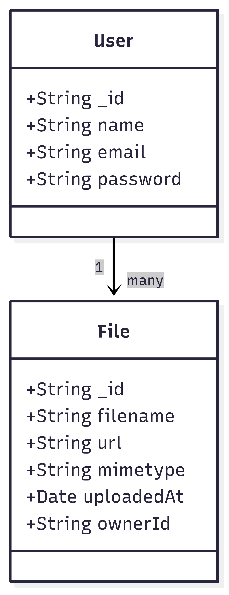

# CloudNest – Cloud File Storage Platform

## Project Overview
CloudNest is a cloud-based file storage web application that allows users to securely upload, store, and manage their files online.  
It is designed as a lightweight alternative to platforms like Google Drive or Dropbox.

## Features
- **User Authentication**: Register & Login with secure credentials.
- **File Management**:
  - Upload files with metadata stored in MongoDB.
  - Delete files from the cloud.
  - View all uploaded files in the dashboard.
- **Cloud Integration**: Files are stored in **Cloudinary** while metadata is managed in **MongoDB**.
- **Responsive UI**: Built with **EJS templates** for simplicity and clarity.
- **Environment-based Security**: Credentials are protected with `.env` configuration.

## Tech Stack
| Layer       | Technology              |
|-------------|--------------------------|
| Frontend    | EJS, CSS                |
| Backend     | Node.js, Express.js     |
| Database    | MongoDB Atlas           |
| File Storage| Cloudinary              |
| Auth        | Session-based Auth      |
| Deployment  | (e.g., Render)   |

## Live Demo
Check out the live project here: [CloudNest Live](https://cloudnest-xdc5.onrender.com/)

## Demo Video
[](https://youtu.be/tfdIUjHBly8)

## Screenshots
Here are some views of CloudNest in action:

- **Home Page**  
  

- **Upload Dashboard**  
  

## System Design & Diagrams

### ER Diagram


### Level 0 DFD


### Level 1 DFD


### Use Case Diagram


### System Architecture


### Sequence Diagram


### Class Diagram


## Getting Started

1. **Clone the repository:**
   ```bash
   git clone <your-repo-link>
   cd cloudnest
   ```
2. **Install dependencies:**
   ```bash
   npm install
   ```
3. **Set up environment variables:**
   Create a .env file in the root with:
   ```bash
   CLOUDINARY_CLOUD_NAME=your_cloud_name
   CLOUDINARY_API_KEY=your_api_key
   CLOUDINARY_API_SECRET=your_api_secret
   MONGODB_URI=your_mongodb_uri
   SESSION_SECRET=your_secret_key
   ```
4. **Run the app:**
   ```bash
   npm start
   ```
5. **Open in browser:**
    ```bash
    http://localhost:3000
    ```

## Future Enhancements

-Multi-file uploads with drag-and-drop support.
-Sharing files via unique links.
-Role-based access control (admin vs user).
-Real-time storage usage dashboard.

## Conclusion

CloudNest demonstrates how to integrate cloud storage services with a Node.js backend and a MongoDB database.
It provides a scalable and secure file management solution, while also showcasing practical use of Multer, Cloudinary API, and session-based authentication.

## Author
**Ankkit Seth** – Full Stack Developer  
Portfolio: [ankkit.site](https://ankkit.site)  
GitHub: [github.com/AnkkitSeth](https://github.com/AnkkitSeth)  
LinkedIn: [linkedin.com/in/ankkit-seth-495182237/](https://www.linkedin.com/in/ankkit-seth-495182237/)  
Email: ankkitseth@gmail.com  

Passionate about web development, building full-stack applications, and exploring new technologies.
     
